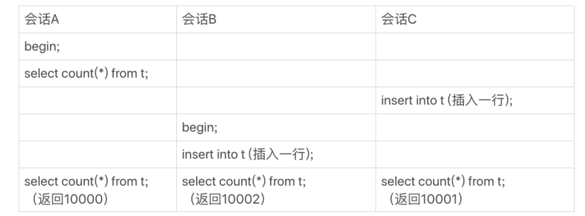

## count
### 14.1 count(*)的实现方式
+ MyISAM引擎把一个表的总行数存在了磁盘上,因此执行count(*)的时候会直接返回这个数,效率很高;
+ 而InnoDB引擎就麻烦了,它执行count(*)的时候,需要把数据一行一行地从引擎里面读出来,然后累积计数。

### 14.2 那为什么InnoDB不跟MyISAM一样,也把数字存起来呢?
这是因为即使是在同一个时刻的多个查询,由于多版本并发控制(MVCC)的原因,InnoDB
表“应该返回多少行”也是不确定的。这里,我用一个算count(*)的例子来为你解释一下。

到这里我们小结一下
+ MyISAM表虽然count(*)很快,但是不支持事务;
+ showtable status命令虽然返回很快,但是不准确;
+ InnoDB表直接count(*)会遍历全表,虽然结果准确,但会导致性能问题。

### 14.3 不同的count的用法
+ count(id) : 对于count(主键id)来说,InnoDB引擎会遍历整张表,把每一行的id值都取出来,返回给server层。server层拿到id后,判断是不可能为空的,就按行累加。
+ count(1) : 对于count(1)来说,InnoDB引擎遍历整张表,但不取值。server层对于返回的每一行,放一个数字“1”进去,判断是不可能为空的,按行累加。
+ count(\*) : 并不会把全部字段取出来,而是专门做了优化,不取值。count(\*)肯定不是null,按行累加。

