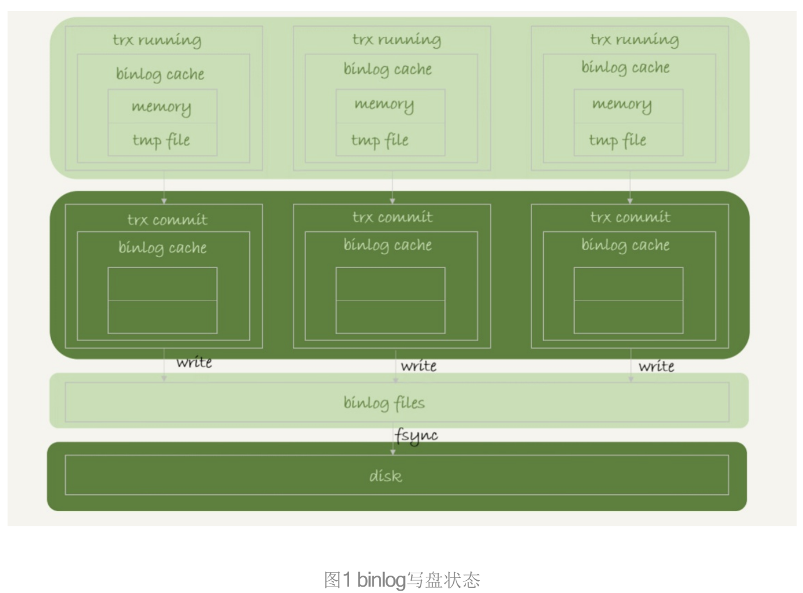
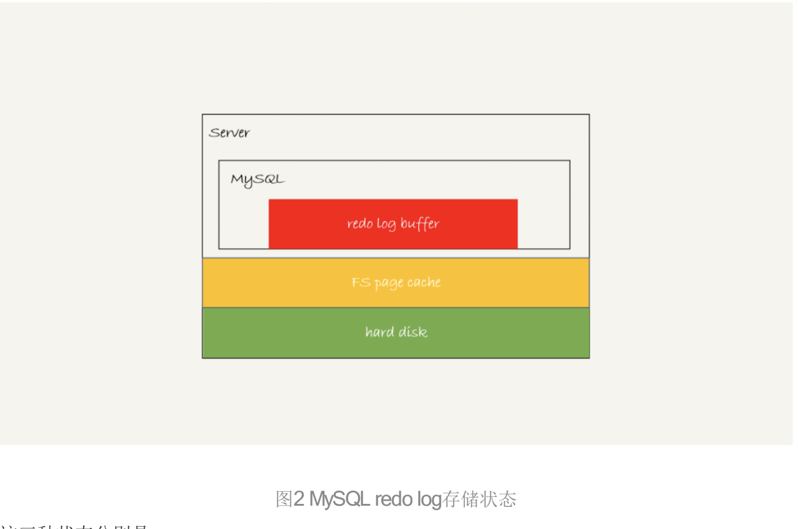

## mysql如何保证数据不丢的
先说一个结论: 只要redo log和binlog保证持久化到磁盘,就能确保MySQL异常重启后,数据可以恢复。所以我们只需要确保redo log 和binlog数据不丢失,就可以确保mysql的crash safe
### binlog 的写入机制
binlog 写入机制比较简单,事务执行过程中,先把日志写入到binlog cache,事务提交的时候再把binlog cache写入到binlog文件中

一个事务的binlog不能拆开,无论多大,也必须确保一次性写入

系统给binlog cache分配了一片内存,参数binlog_cache_size用于控制单个线程中binlog cache所占的内存大小,如果超过了这个大小,就会暂存到磁盘

图中的write是把日志写到文件系统的page cache,并没有把数据持久化到磁盘,所以速度很快

fsync才是将数据库持久化的操作,fsync才会占用磁盘IOPS

write和fsync的时机是由sync_binlog来控制的:
1. sync_binlog = 0 表示每次事务提交只write,不fsync
2. sync_binlog = 1 表示每次事务提交都会执行fsync
3. sync_binlog = N(N>1) 表示每N次事务提交后都会执行fsync

结论:一般不会设置为0,mysql默认是1,在出现IO瓶颈的场景中可以将值设置成100~1000这个场景,但是将sync_binlog设置成N的风险是在宕机时有可能会丢失最近的N个事务

### redo log 的写入机制
redo log 可能存在的三种状态

为了控制redo log的写入策略,InnoDB提供了innodb_flush_log_at_trx_commit参数控制
1. 设置为0,表示每次事务提交只是把redo log留在redo log buffer里面
2. 设置为1,表示每次事务提交都会直接持久化到磁盘
3. 设置为2,表示每次事务提交只是把redo log写到page cache

InnoDB有一个后台线程,每隔1秒,就会把redo log buffer中的日志,调用write写到文件系统的page cache,然后调用fsync持久化到磁盘。

除了每秒一次的轮询操作之外,还有两种场景会让一个没有提交事务
1. redo log buffer占用空间达到innodb_log_buffer_size一半大小的时候,后台线程会主动写盘.因为没有事务提交,所以只是写在page cache中,并没有持久化到disk
2. 另一种是,并行事务提交的时候,会随带将redo log buffer持久化到disk

通常mysql的双1配置,也就是sync_binlog和innodb_flush_log_at_trx_commit都设置成1,也就是说在事务提交之前,需要等待两次刷盘,一次redo log prepare,一次binlog,如果这样的话那么TPS不是很低吗,看看mysql是怎么解决这个问题的

mysql用了组提交(group commit)的机制优化这个问题.

#### group commit
首先介绍一下日志序列号 (LSN ,log sequence number)这个概念,number,LSN)的概念。LSN是单调递增的,用来对应redo log的一个个写入点。每次写入长度为length的redo log, LSN的值就会加上length。

比如三个并发事务,tx1,tx2,tx3同时到达prepare阶段提交,持久化到磁盘的过程,对应的LSN分别是50、120 和160。
tx1第一个到达,那么tx1会被选为这组的header,tx1写盘的时候,redo log buffer里面已经有了三个事务,tx1带上的LSN就是160,所有LSN小于160的redo log就已经被持久化到磁盘了

                                           

