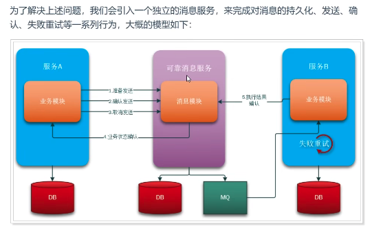
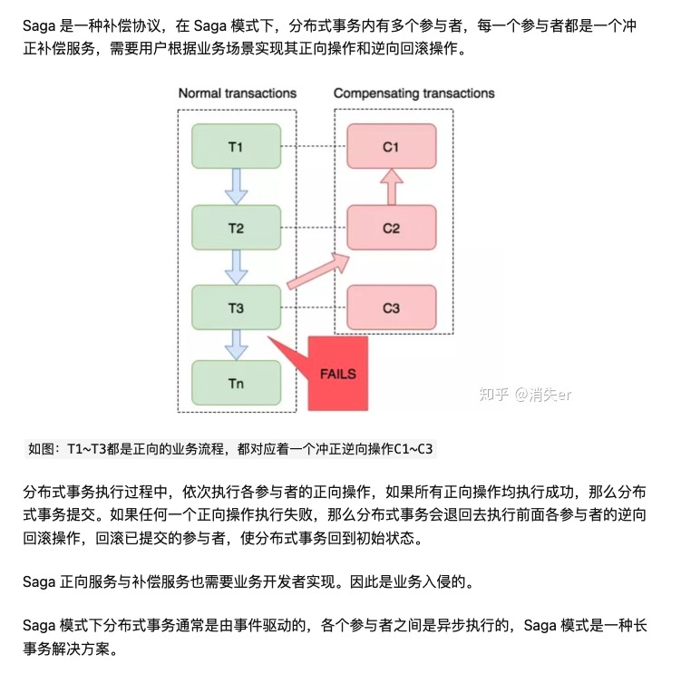

* [如何保障mysql和redis之间的数据一致性](https://juejin.cn/post/6844904073783689224)
* [再有人问你分布式事务，把这篇扔给他](https://juejin.cn/post/6844903647197806605#heading-15)
* [CAP理论和Base理论](https://zhuanlan.zhihu.com/p/335617791)
* [MySQL对分布式事务（XA Transactions）的支持](http://www.asktheway.org/2020/04/26/266/)

### 2pac XA 一句话总结
+ 优点: 强一致性,实现简单
+ 缺点: 1.协调者单点故障  2.阻塞

### TCC (try,confirm,cancel) 一句话总结
+ 优点: 每一个阶段都会提交事务,不会阻塞,性能好
+ 缺点: 1.大量侵入式代码 2.业务代码分为三部分,增加复杂度  3.如果confirm失败,需要retry,还需要考虑幂等性

* [用Go轻松完成一个TCC分布式事务，保姆级教程](https://segmentfault.com/a/1190000040331793)
* [golang 分布式框架DTM](https://github.com/dtm-labs/dtm)

### 本地消息表和MQ事务

MQ事务原理和本地消息表差不多,只是把这个确认过程放在了MQ中.目前RocketMQ 和 ActiveMQ都支持事务

* [分布式事务的4种模式](https://zhuanlan.zhihu.com/p/78599954)

### saga模式

### 最大努力通知
* [最大努力通知](https://dtm.pub/practice/other.html#%E6%9C%80%E5%A4%A7%E5%8A%AA%E5%8A%9B%E9%80%9A%E7%9F%A5)

### AT事务模式
* [AT事务模式](https://dtm.pub/practice/other.html#at%E4%BA%8B%E5%8A%A1%E6%A8%A1%E5%BC%8F)

AT模式本质捕获你的执行SQL 保存一份这个sql语句影响的数据在执行sql之前的image ,然后再保存一份执行之后的image,对比两个数据,
如果两个数据不一致,说明成功了,如果两个数据一致,说明失败,回滚到之前的before image