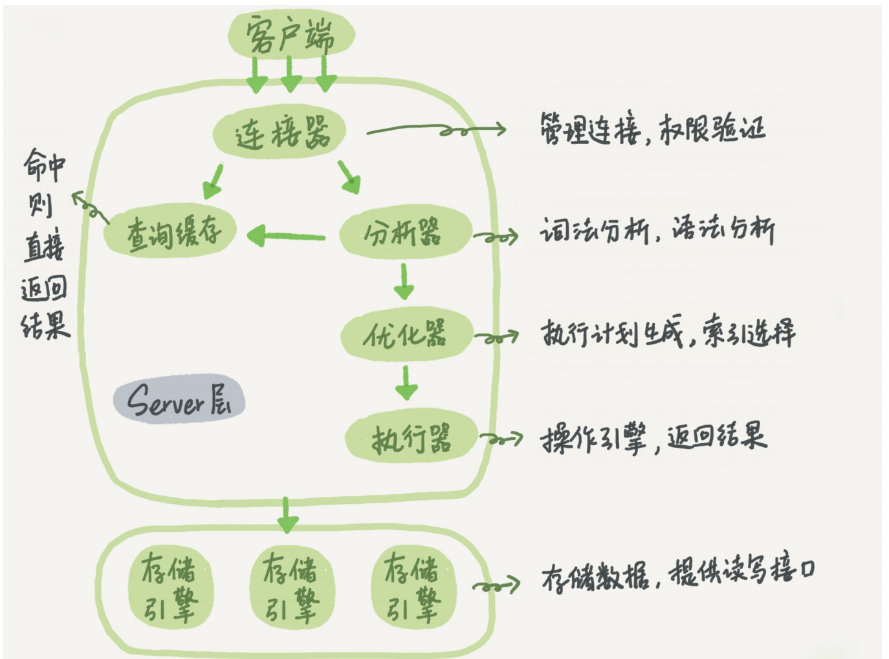
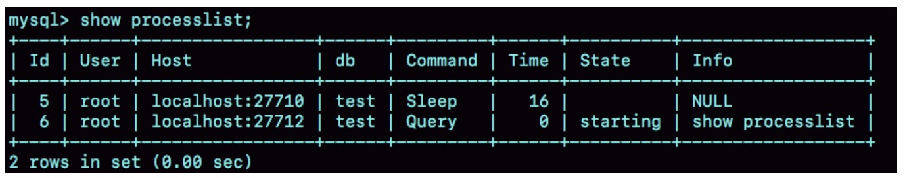

## MYSQL的基础架构
### 1.1架构示意图


Server层包括连接器、查询缓存、分析器、优化器、执行器等,涵盖MySQL的大多数核心服务
功能,以及所有的内置函数(如日期、时间、数学和加密函数等),所有跨存储引擎的功能都在
这一层实现,比如存储过程、触发器、视图等。

而存储引擎层负责数据的存储和提取。其架构模式是插件式的,支持InnoDB、MyISAM、
Memory等多个存储引擎。现在最常用的存储引擎是InnoDB,它从MySQL 5.5.5版本开始成为了
默认存储引擎。

### 1.2 SERVER层
####1.2.1 连接器
第一步,你会先连接到这个数据库上,这时候接待你的就是连接器.

连接完成后,如果你没有后续的动作,这个连接就处于空闲状态,你可以在showprocesslist命
令中看到它。文本中这个图是showprocesslist的结果,其中的Command列显示为“Sleep”的这
一行,就表示现在系统里面有一个空闲连接。



客户端如果太长时间没动静,连接器就会自动将它断开。这个时间是由参数wait_timeout控制
的,默认值是8小时。

Mysql 连接一般使用长连接,但是长时间使用会发现mysql内存涨的很快,长期积累下来可能会被系统强制杀掉.
这个时候有两种方案:
1. 定时断开
2. mysql 5.7以后可能使用mysql_reset_connection来重新初始化连接资源。这个过程不需要重连和重新做权限验证,但是会将连接恢复到刚刚创建完时的状态。

####1.2.2 缓存
mysql 8.0已经将缓存模块彻底删掉了,不用了解了

####1.2.3 分析器
根据词法分析的结果,语法分析器会根据语法规则,判断你输入的这个SQL语句是否满足MySQL语法。

如果你的语句不对,就会收到“You have an error in your SQL syntax”的错误提醒

####1.2.4 优化器
优化器是在表里面有多个索引的时候,决定使用哪个索引;或者在一个语句有多表关联(join)
的时候,决定各个表的连接顺序。比如你执行下面这样的语句,这个语句是执行两个表的join:
```
mysql> select * from t1 join t2 using(ID) where t1.c=10 and t2.d=20;
```
+ 既可以先从表t1里面取出c=10的记录的ID值,再根据ID值关联到表t2,再判断t2里面d的值是
否等于20。
+ 也可以先从表t2里面取出d=20的记录的ID值,再根据ID值关联到t1,再判断t1里面c的值是否
等于10。

这两种执行方法的逻辑结果是一样的,但是执行的效率会有不同,而优化器的作用就是决定选择使用哪一种方案

#### 1.2.5 执行器
开始执行的时候,要先判断一下你对这个表T有没有执行查询的权限,如果没有,就会返回没有
权限的错误.

比如我们这个例子中的表T中,ID字段没有索引,那么执行器的执行流程是这样的:
1. 调用InnoDB引擎接口取这个表的第一行,判断ID值是不是10,如果不是则跳过,如果是则
将这行存在结果集中;
2. 调用引擎接口取“下一行”,重复相同的判断逻辑,直到取到这个表的最后一行。
3. 执行器将上述遍历过程中所有满足条件的行组成的记录集作为结果集返回给客户端。
至此,这个语句就执行完成了。

对于有索引的表,执行的逻辑也差不多。第一次调用的是“取满足条件的第一行”这个接口,之后
循环取“满足条件的下一行”这个接口,这些接口都是引擎中已经定义好的。
你会在数据库的慢查询日志中看到一个rows_examined的字段,表示这个语句执行过程中扫描了
多少行。这个值就是在执行器每次调用引擎获取数据行的时候累加的。
