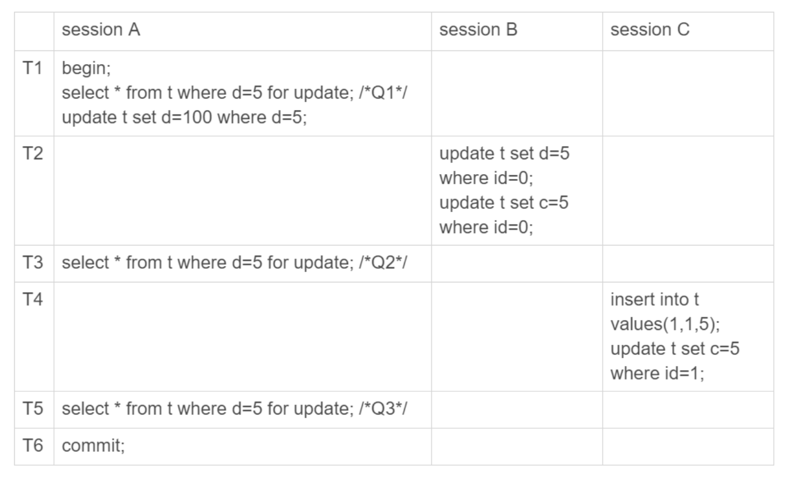
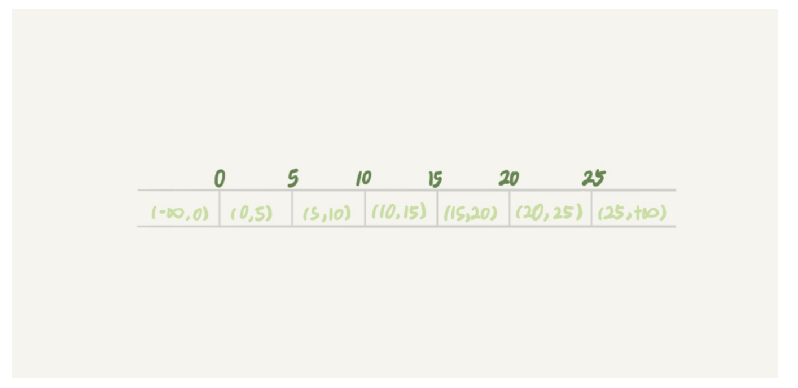
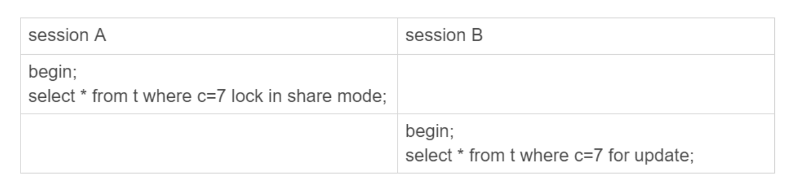
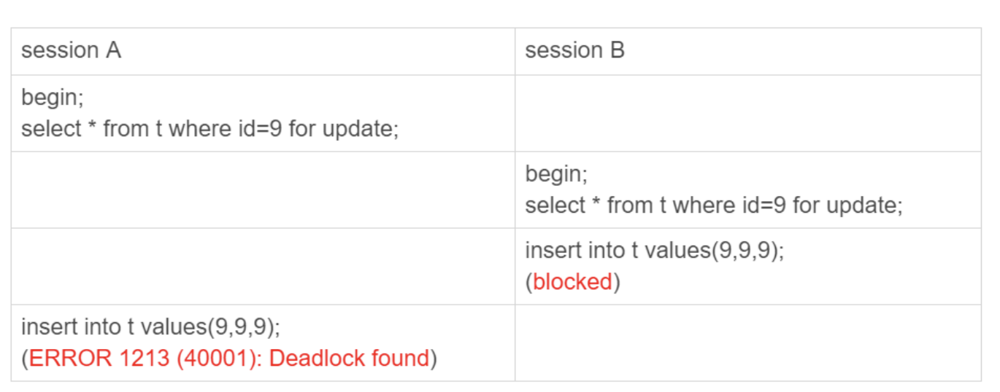
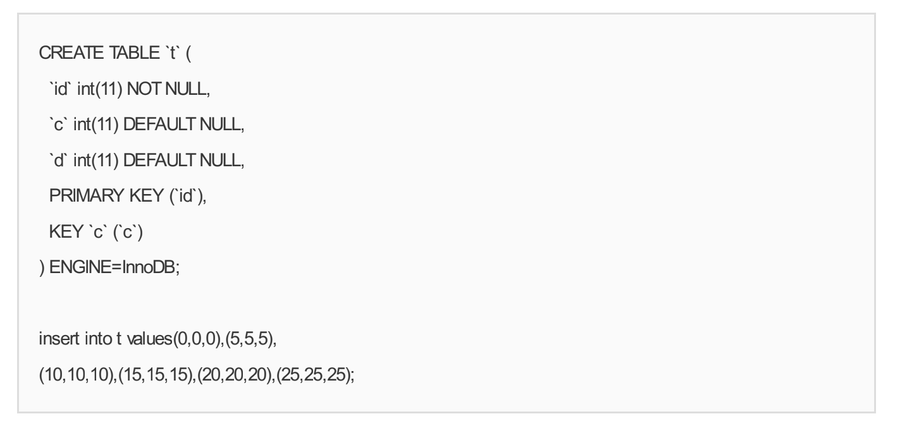
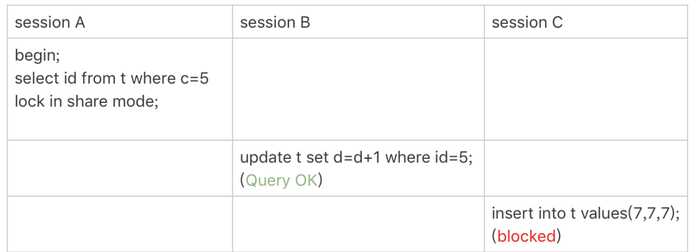
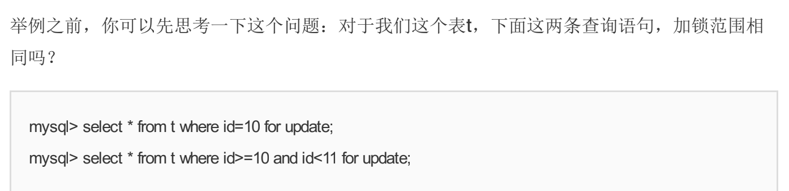
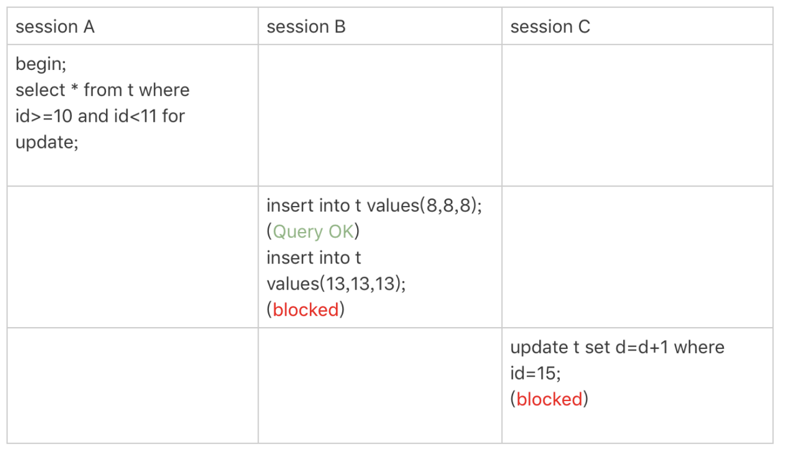
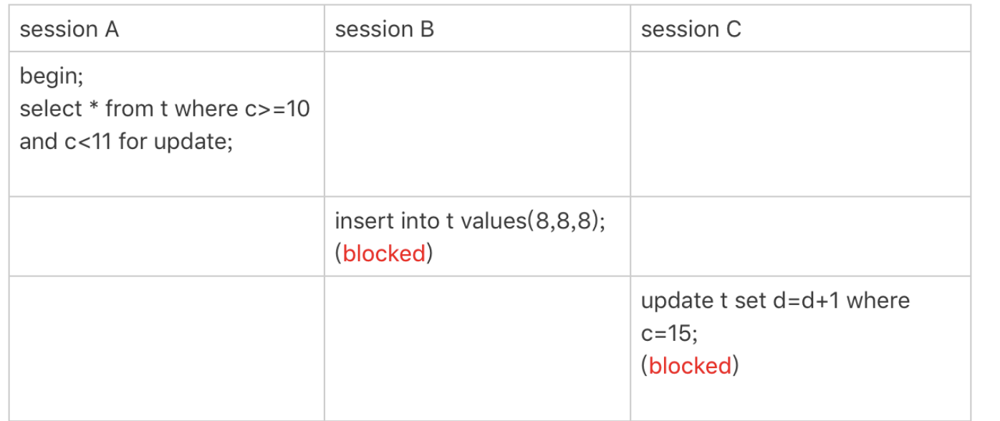

### 行锁的问题


按照图片上面的逻辑执行下来得到的结果应该是:
1. T1 id=5这一行,结果是(5,5,100),当然这是在T6阶段正式提交的
2. T2 id=0这一行(0,5,5)
3. T4 id=1这一行(1,5,5)

这样看数据是没什么问题的,但是我们可以来看看binlog里面的内容
1. T2时刻,session B事务提交,写入了两条语句;
2. T4时刻,session C事务提交,写入了两条语句;
3. T6时刻,session A事务提交,写入了update t set d=100 where d=5 这条语句。

统一放到一起的话,就是这样的:
```
update t set d=5 where id=0; /*(0,0,5)*/
update t set c=5 where id=0; /*(0,5,5)*/

insert into t values(1,1,5); /*(1,1,5)*/
update t set c=5 where id=1; /*(1,5,5)*/

update t set d=100 where d=5;/*所有d=5的行,d改成100*/
```

这个binlog日志,无论是拿到从库去执行,还是以后用binlog恢复数据,都会出大问题,得到的结果会是
(0,5,100),(1,5,100),(5,5,100),也就是说id=0和1的这两条数据严重不符合

### 间隙锁
顾名思义就是锁住两个值之间的间隙,如:


```
select * from t where id=5 for update
```
这句sql就不止是给id=5的这一行加锁,还会加上7个间隙锁,确保不会产生新的记录

间隙锁与锁之间不会产生冲突,产生冲突的是与 "往间隙中插入一个记录"这个操作,比如:



这个session b 并不会被堵住,因为c=7这一行不存在,所以session a 加的只是间隙锁(5,10),session b
也是在(5,10)这个间隙加的间隙锁,它们都是保护这个间隙不会有数据插入,所以它们不会冲突

间隙锁和行锁合并称为next-key lock

next-key lock帮我们解决了一些并发时的幻读问题,但是也带来了一些新的问题,比如:


id=9不存在,就会形成(5,10)的间隙锁,session b 插入的时候会被session a 的间隙锁挡住,session a 的insert也被 session b 的间隙锁挡住了,
这个时候系统检测到死锁的发生,报出了deadlock found

### 加锁规则总结
1. 原则1:加锁的基本单位是next-key lock。希望你还记得,next-key lock是前开后闭区间。
2. 原则2:查找过程中访问到的对象才会加锁。
3. 优化1:索引上的等值查询,给唯一索引加锁的时候,next-key lock退化为行锁。
4. 优化2:索引上的等值查询,向右遍历时且最后一个值不满足等值条件的时候,next-key
lock退化为间隙锁。
5. 一个bug:唯一索引上的范围查询会访问到不满足条件的第一个值为止。

#### 初始化一张表用于下面的案例演示


#### 案例一:等值查询间隙锁


1. 根据原则1,next-key lock 前开后闭,所以加锁范围是[5,10]
2. 根据优化2,等值查询id=7,向右查找且最后一个值id=10不满足时,next-key lock退化为间隙锁,范围[5,10]
3. 所以session b插入id=8会被锁住,而session c 更新id=10却不会

#### 案例二:非唯一索引等值锁


1. 根据原则1,会给[0,5]加上next-key lock
2. 由于c是普通索引,并不是唯一索引或者主键,所以仅访问到id=5是不能停下来的,会继续向右查到id=10才会停下来,同时根据原则2访问到的都要加锁,因此给[5,10]加上next-key lock
3. 这个操作同时符合优化2,所以next-key lock退化为间隙锁[5,10]
4. 根据原则2,访问到的都会加锁,session a 的语句用了覆盖索引,并不需要访问主键,所以主键索引上并没有加锁,因此session b的更新可以成功
5. session c 的id=7插入被session a的间隙锁锁住,插入失败

需要注意的在上面这个例子中,lock in share mode只会锁覆盖索引,但是for update却不是,因为for update会认为要更新数据,会锁住主键id

#### 案例三:主键索引范围锁




1. session a语句中 id>=10,找到了id=10,本该是next-key lock[5,10],根据优化1,给唯一索引加锁,next-key lock退化成行锁,锁住id=10
2. id<11,根据范围继续往后找,找到id=15,加上next-key lock[10,15]
3. 所以这里的锁就是i=10的行锁和next-key lock[10,15]
4. 所以session b的插入id=13和session c的id=15的更新都失败了

需要注意的是,这里id=10是当做等值查询判断,id<11是返回判断

#### 案例四:非唯一索引的范围所


1. session a语句中,id>=10,是next-key lock[5,10]
2. session a语句中,id<11,是next-key lock[10,15]
3. 所以session b的插入id=8和session c的更新id=15都失败了


