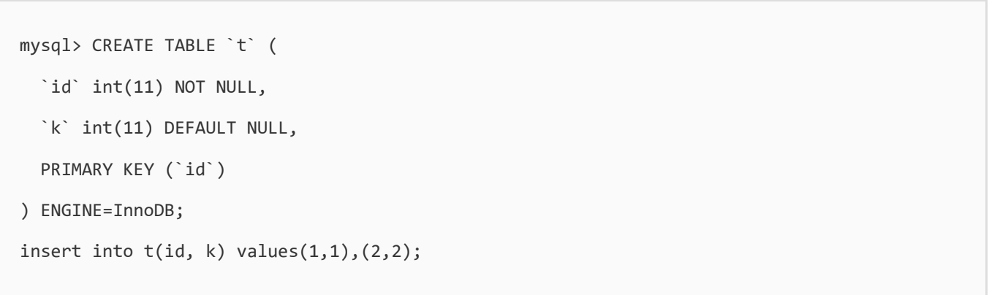
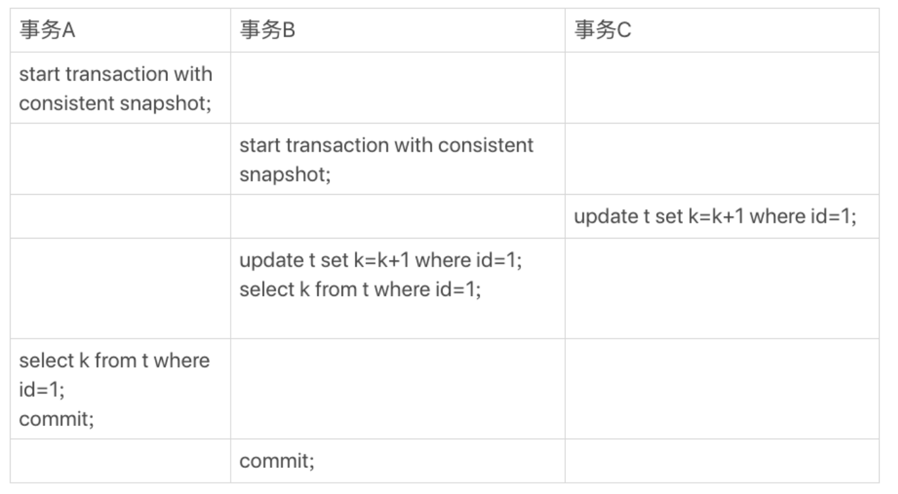

## 事务与mvcc
可重复读这个特性值只是对于select,并不会影响update,比如:

事务B查询到的值是3,事务一查询到的是1

### 快照在mvcc中是如何工作的
InnoDB里面每个事务有一个唯一的事务ID,叫作transaction id。它是在事务开始的时候向
InnoDB的事务系统申请的,是按申请顺序严格递增的。

而每行数据也都是有多个版本的。每次事务更新数据的时候,都会生成一个新的数据版本,并且
把transaction id赋值给这个数据版本的事务ID,记为row trx_id。同时,旧的数据版本要保留,
并且在新的数据版本中,能够有信息可以直接拿到它。

也就是说,数据表中的一行记录,其实可能有多个版本(row),每个版本有自己的row trx_id。

