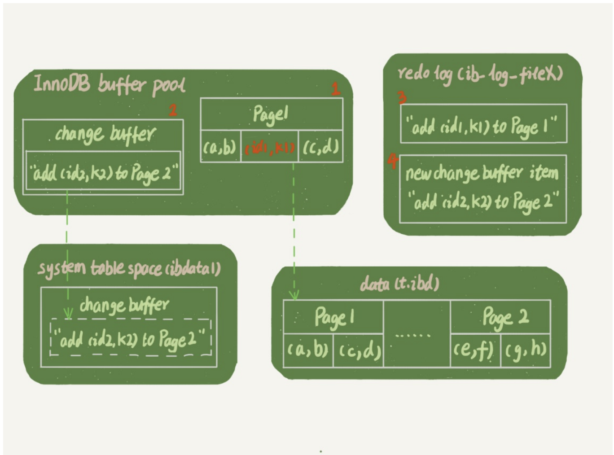
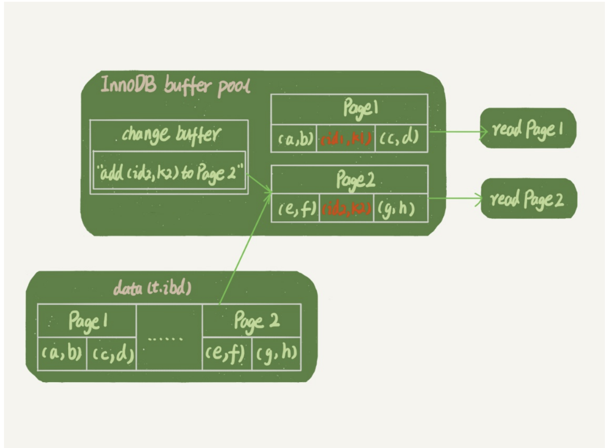

## 索引的选择和优化
### 9.1 普通索引和唯一索引
#### 9.1.1 查找过程
执行查询的语句是 select id fromTwhere k=5。这个查询语句在索引树上查找的过程,先
是通过B+树从树根开始,按层搜索到叶子节点,也就是图中右下角的这个数据页,然后可以认
为数据页内部通过二分法来定位记录。

+ 对于普通索引来说,查找到满足条件的第一个记录(5,500)后,需要查找下一个记录,直到碰到第一个不满足k=5条件的记录。
+ 对于唯一索引来说,由于索引定义了唯一性,查找到第一个满足条件的记录后,就会停止继续检索。

这个不同操作带来的影响其实微乎其微,因为你知道的,InnoDB的数据是按数据页为单位来读写的。也就是说,当需要读一条记录的时候,
  并不是将这个记录本身从磁盘读出来,而是以页为单位,将其整体读入内存。在InnoDB中,每
个数据页的大小默认是16KB,一个数据页可以存放近千个key,所以出现这种的概率很低.

#### 9.1.2 更新过程
当需要更新一个数据页时,如果数据页在内存中就直接更新,而如果这个数据页还没有在内存中
的话,在不影响数据一致性的前提下,InooDB会将这些更新操作缓存在change buffer中,这样
就不需要从磁盘中读入这个数据页了。在下次查询需要访问这个数据页的时候,将数据页读入内
存,然后执行change buffer中与这个页有关的操作。通过这种方式就能保证这个数据逻辑的正
确性。

对于唯一索引来说,所有的更新操作都要先判断这个操作是否违反唯一性约束。比如,要插入
(4,400)这个记录,就要先判断现在表中是否已经存在k=4的记录,而这必须要将数据页读入内存
才能判断。如果都已经读入到内存了,那直接更新内存会更快,就没必要使用change buffer
了。因此,唯一索引的更新就不能使用change buffer,实际上也只有普通索引可以使用。

##### 9.1.2.1 这时,InnoDB的处理流程如下:
第一种情况是,这个记录要更新的目标页在内存中。
+ 对于唯一索引来说,找到3和5之间的位置,判断到没有冲突,插入这个值,语句执行结束;
+ 对于普通索引来说,找到3和5之间的位置,插入这个值,语句执行结束。

这样看来,普通索引和唯一索引对更新语句性能影响的差别,只是一个判断,只会耗费微小的
CPU时间。

##### 9.1.2.2 这时,这个记录要更新的目标页不在内存中:
这时,InnoDB的处理流程如下:
+ 对于唯一索引来说,需要将数据页读入内存,判断到没有冲突,插入这个值,语句执行结
束;
+ 对于普通索引来说,则是将更新记录在change buffer,语句执行就结束了。

将数据从磁盘读入内存涉及随机IO的访问,是数据库里面成本最高的操作之一。change buffer
因为减少了随机磁盘访问,所以对更新性能的提升是会很明显的。

## 9.2 change buffer的使用场景
因为merge的时候是真正进行数据更新的时刻,而change buffer的主要目的就是将记录的变更动
作缓存下来,所以在一个数据页做merge之前,change buffer记录的变更越多(也就是这个页面
上要更新的次数越多),收益就越大。

因此,对于写多读少的业务来说,页面在写完以后马上被访问到的概率比较小,此时change
buffer的使用效果最好。这种业务模型常见的就是账单类、日志类的系统。

反过来,假设一个业务的更新模式是写入之后马上会做查询,那么即使满足了条件,将更新先记
录在change buffer,但之后由于马上要访问这个数据页,会立即触发merge过程。这样随机访问
IO的次数不会减少,反而增加了change buffer的维护代价。所以,对于这种业务模式来
说,change buffer反而起到了副作用。

## 9.3 change buffer 和 redo log
这里,我们假设当前k索引树的状态,查找到位置后,k1所在的数据页在内存(InnoDB buffer
pool)中,k2所在的数据页不在内存中。如图2所示是带change buffer的更新状态图。

分析这条更新语句,你会发现它涉及了四个部分:内存、redo log(ib_log_fileX)、 数据表空间
(t.ibd)、系统表空间(ibdata1)。
这条更新语句做了如下的操作(按照图中的数字顺序):
1. Page 1在内存中,直接更新内存;
2. Page 2没有在内存中,就在内存的change buffer区域,记录下“我要往Page 2插入一行”这个
信息
3. 将上述两个动作记入redo log中(图中3和4)。

做完上面这些,事务就可以完成了。所以,你会看到,执行这条更新语句的成本很低,就是写了两处内存,然后写了一处磁盘(两次操作合在一起写了一次磁盘),而且还是顺序写的。
同时,图中的两个虚线箭头,是后台操作,不影响更新的响应时间。

那在这之后的读请求,要怎么处理呢?
比如,我们现在要执行 select *fromt where k in (k1, k2)。这里,我画了这两个读请求的流程
图。

如果读语句发生在更新语句后不久,内存中的数据都还在,那么此时的这两个读操作就与系统表空间(ibdata1)和 redo log(ib_log_fileX)无关了。所以,我在图中就没画出这两部分。

1. 读Page 1的时候,直接从内存返回。有几位同学在前面文章的评论中问到,WAL之后如果读数据,是不是一定要读盘,是不是一定要从redo log里面把数据更新以后才可以返回?其实是不用的。你可以看一下图3的这个状态,虽然磁盘上还是之前的数据,但是这里直接从内存返回结果,结果是正确的。
2. 要读Page 2的时候,需要把Page 2从磁盘读入内存中,然后应用change buffer里面的操作日志,生成一个正确的版本并返回结果。

可以看到,直到需要读Page 2的时候,这个数据页才会被读入内存。所以,如果要简单地对比这两个机制在提升更新性能上的收益的话,redo log 主要节省的是随
机写磁盘的IO消耗(转成顺序写),而change buffer主要节省的则是随机读磁盘的IO消
耗。

## 9.4 字符串前缀索引
使用好的前缀索引可以节约空间,但是使用前缀索引之后就不能用到覆盖索引的特性了

### 9.4.1 字符串索引的一些技巧
比如身份证号这种前面区分不大的,我们可以使用倒叙存储或者hash字段

