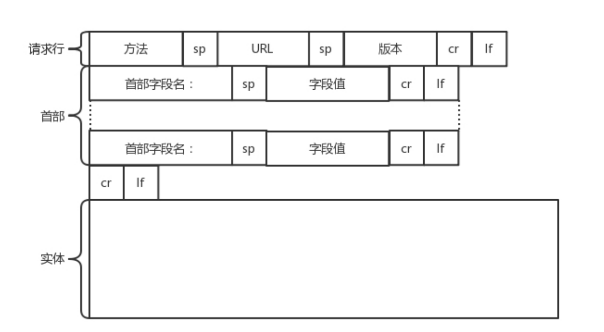
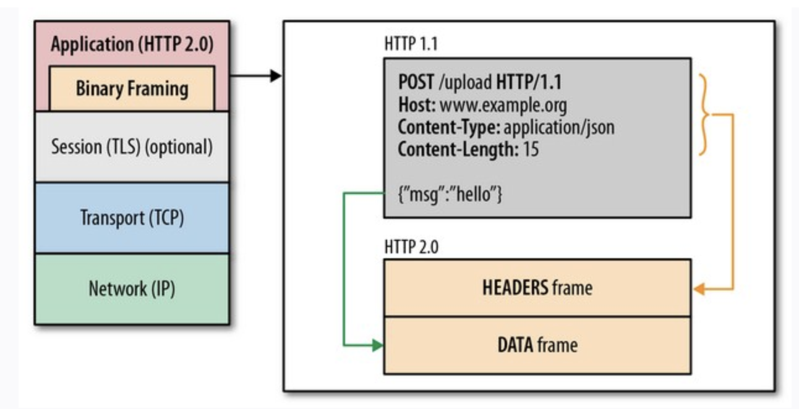

# HTTP

## HTTP 图解结构
  

### 1.请求行
+ 方法 : GET,POST,PUT,DELETE
+ URL : 资源定位符
+ 版本 : HTTP/1.1 HTTP/2.0

### 2.首部字段
请求行下面就是我们的首部字段。首部是 key value，通过冒号分隔。这里面，往往保存了一些非常重要
的字段。
+ Accept-Charset，表示客户端可以接受的字符集。防止传过来的是另外的字符集，从而导致出现乱码。
+ Content-Type是指正文的格式。例如，我们进行 POST 的请求，如果正文是 JSON，那么我们就应该将这个值设置为 JSON。
+ Cache-control 是用来控制缓存的。当客户端发送的请求中包含 max-age 指令时，如
  果判定缓存层中，资源的缓存时间数值比指定时间的数值小，那么客户端可以接受缓存的资源；当指定
  max-age 值为 0，那么缓存层通常需要将请求转发给应用集群。

## HTTP 1.1
### keep-active
http1.1 的连接复用,针对同一个服务器的http请求,使用同一个tcp连接,不用每一个http请求都建立tcp协议.

## HTTP 2.0
### 头压缩
模式的话，每次的过程总是像上面描述的那样一去一回。这样在实时性、并发性上都存在问题。  

为了解决这些问题，HTTP 2.0 会对 HTTP 的头进行一定的压缩，将原来每次都要携带的大量 key value
在两端建立一个索引表，对相同的头只发送索引表中的索引。

### 分帧,二进制压缩
既然又要保证HTTP的各种动词，方法，首部都不受影响，那就需要在应用层(HTTP2.0)和传输层(TCP or UDP)之间增加一个二进制分帧层。

在二进制分帧层上，HTTP 2.0 会将所有传输的信息分割为更小的消息和帧,并对它们采用二进制格式的编码 ，其中HTTP1.x的首部信息会被封装到Headers帧，而我们的request body则封装到Data帧里面

### 多路复用
HTTP2.0中,基于二进制分帧层，HTTP2.0可以在共享TCP连接的基础上同时发送请求和响应。HTTP消息被分解为独立的帧，而不破坏消息本身的语义，交错发出去，在另一端根据流标识符和首部将他们重新组装起来。 通过该技术，可以避免HTTP旧版本的队头阻塞问题，极大提高传输性能。

#### 队头阻塞
##### TCP 队头阻塞
队头阻塞（head-of-line blocking）发生在一个TCP分节丢失，导致其后续分节不按序到达接收端的时候。该后续分节将被接收端一直保持直到丢失的第一个分节被发送端重传并到达接收端为止。该后续分节的延迟递送确保接收应用进程能够按照发送端的发送顺序接收数据。这种为了达到完全有序而引入的延迟机制非常有用，但也有不利之处。

##### 解决TCP 队头阻塞
TCP中的队头阻塞的产生是由TCP自身的实现机制决定的，无法避免。想要在应用程序当中避免TCP队头阻塞带来的影响，只有舍弃TCP协议。  

比如google推出的quic协议，在某种程度上可以说避免了TCP中的队头阻塞，因为它根本不使用TCP协议，而是在UDP协议的基础上实现了可靠传输。而UDP是面向数据报的协议，数据报之间不会有阻塞约束

##### HTTP队头阻塞
前面提到HTTP管道化要求服务端必须按照请求发送的顺序返回响应，那如果一个响应返回延迟了，那么其后续的响应都会被延迟，直到队头的响应送达

##### 解决 HTTP 队头阻塞
对于HTTP1.1中管道化导致的请求/响应级别的队头阻塞，可以使用HTTP2解决。HTTP2不使用管道化的方式，而是引入了帧、消息和数据流等概念，每个请求/响应被称为消息，每个消息都被拆分成若干个帧进行传输，每个帧都分配一个序号。每个帧在传输是属于一个数据流，而一个连接上可以存在多个流，各个帧在流和连接上独立传输，到达之后在组装成消息，这样就避免了请求/响应阻塞。

## HTTP 3.0 (QUIC)
HTTP 2.0 虽然大大增加了并发性，但还是有问题的。因为 HTTP 2.0 也是基于 TCP 协议的，TCP 协议
在处理包时是有严格顺序的。  

当其中一个数据包遇到问题，TCP 连接需要等待这个包完成重传之后才能继续进行。虽然 HTTP 2.0 通
过多个 stream，使得逻辑上一个 TCP 连接上的并行内容，进行多路数据的传输，然而这中间并没有关
联的数据。一前一后，前面 stream 2 的帧没有收到，后面 stream 1 的帧也会因此阻塞。

于是，就又到了从 TCP 切换到 UDP，进行“城会玩”的时候了。这就是 Google 的 QUIC 协议，接下
来我们来看它是如何“城会玩”的。

### 机制一：自定义连接机制
我们都知道，一条 TCP 连接是由四元组标识的，分别是源 IP、源端口、目的 IP、目的端口。一旦一个
元素发生变化时，就需要断开重连，重新连接。在移动互联情况下，当手机信号不稳定或者在 WIFI 和
移动网络切换时，都会导致重连，从而进行再次的三次握手，导致一定的时延。
这在 TCP 是没有办法的，但是基于 UDP，就可以在 QUIC 自己的逻辑里面维护连接的机制，不再以四
元组标识，而是以一个 64 位的随机数作为 ID 来标识，而且 UDP 是无连接的，所以当 IP 或者端口变化
的时候，只要 ID 不变，就不需要重新建立连接。

### 机制二：自定义重传机制
前面我们讲过，TCP 为了保证可靠性，通过使用序号和应答机制，来解决顺序问题和丢包问题。
任何一个序号的包发过去，都要在一定的时间内得到应答，否则一旦超时，就会重发这个序号的包。那
怎么样才算超时呢？还记得我们提过的自适应重传算法吗？这个超时是通过采样往返时间 RTT不断调整
的。

其实，在 TCP 里面超时的采样存在不准确的问题。例如，发送一个包，序号为 100，发现没有返回，于
是再发送一个 100，过一阵返回一个 ACK101。这个时候客户端知道这个包肯定收到了，但是往返时间
是多少呢？是 ACK 到达的时间减去后一个 100 发送的时间，还是减去前一个 100 发送的时间呢？事实
是，第一种算法把时间算短了，第二种算法把时间算长了。

QUIC 也有个序列号，是递增的。任何一个序列号的包只发送一次，下次就要加一了。例如，发送一个
包，序号是 100，发现没有返回；再次发送的时候，序号就是 101 了；如果返回的 ACK 100，就是对第
一个包的响应。如果返回 ACK 101 就是对第二个包的响应，RTT 计算相对准确。
但是这里有一个问题，就是怎么知道包 100 和包 101 发送的是同样的内容呢？QUIC 定义了一个 offset
概念。QUIC 既然是面向连接的，也就像 TCP 一样，是一个数据流，发送的数据在这个数据流里面有个
偏移量 offset，可以通过 offset 查看数据发送到了哪里，这样只要这个 offset 的包没有来，就要重发；
如果来了，按照 offset 拼接，还是能够拼成一个流。

### 机制三：无阻塞的多路复用
有了自定义的连接和重传机制，我们就可以解决上面 HTTP 2.0 的多路复用问题。
同 HTTP 2.0 一样，同一条 QUIC 连接上可以创建多个 stream，来发送多个 HTTP 请求。但是，QUIC
是基于 UDP 的，一个连接上的多个 stream 之间没有依赖。这样，假如 stream2 丢了一个 UDP 包，后
面跟着 stream3 的一个 UDP 包，虽然 stream2 的那个包需要重传，但是 stream3 的包无需等待，就
可以发给用户。

### 机制四：自定义流量控制
TCP 的流量控制是通过滑动窗口协议。QUIC 的流量控制也是通过 window_update，来告诉对端它可
以接受的字节数。但是 QUIC 的窗口是适应自己的多路复用机制的，不但在一个连接上控制窗口，还在
一个连接中的每个 steam 控制窗口。

还记得吗？在 TCP 协议中，接收端的窗口的起始点是下一个要接收并且 ACK 的包，即便后来的包都到
了，放在缓存里面，窗口也不能右移，因为 TCP 的 ACK 机制是基于序列号的累计应答，一旦 ACK 了一
个系列号，就说明前面的都到了，所以只要前面的没到，后面的到了也不能 ACK，就会导致后面的到
了，也有可能超时重传，浪费带宽。

QUIC 的 ACK 是基于 offset 的，每个 offset 的包来了，进了缓存，就可以应答，应答后就不会重发，
中间的空挡会等待到来或者重发即可，而窗口的起始位置为当前收到的最大 offset，从这个 offset 到当
前的 stream 所能容纳的最大缓存，是真正的窗口大小。显然，这样更加准确。

