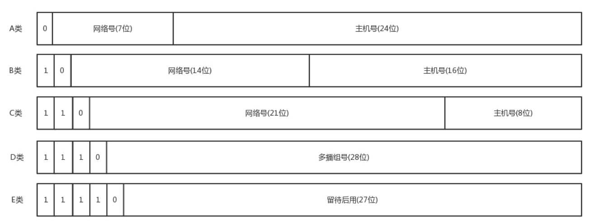
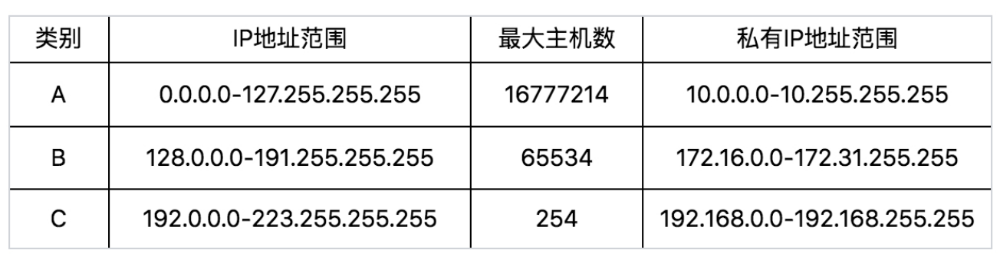

## 查看命令
ifconfig 或者 ip addr  
这两个命令都可以查看ip 分别是基本net-tools 和iproute2的

## IPV4的组成

现在一般常用的是A,B,C三类,下图是A,B,C三类包含的主机数量

目前这种结构的问题C类地址能包含的最大主机数量实在太少了,只有254个,一个网吧都不止这么多
但是B类地址的最大主机数量有太多了有65534个,一般的企业根本达不到这个规模,所以需要一种手段解决这个问题

##无类型域间选路 (CIDR)
CIDR 全称Classless Inter-Domain Routing,这种方式打破了原来设计的几类地址的做
法，将 32 位的 IP 地址一分为二，前面是网络号，后面是主机号。  
10.100.122.2/24，这个ip地址有一个斜杠,斜杠后面有个数字24,表示在这个32位地址中
前面24位表示网络号,后面8位表示主机号  

伴随着 CIDR 存在的，一个是广播地址，10.100.122.255。如果发送这个地址，所有 10.100.122 网络
里面的机器都可以收到。另一个是子网掩码，255.255.255.0。

计算:10.100.122.2/24用二进制表示为 00001010.01100100.01111010.00000010/24  
前24位是网络号,广播地址是00001010.01100100.01111010.11111111 也就是 10.100.122.255
后8位是主机号,子网掩码是11111111.11111111.11111111.0 也就是255.255.255.0

### 一个容易“犯错”的 CIDR
16.158.165.91/22 这个 CIDR。求一下这个网络的第一个地址、子网掩码和广播地址

00010000.10011110.10100101.01011100/22  

/22 不是 8 的整数倍，不好办，只能先变成二进制来看。16.158 的部分不会动，它占了前 16 位。中间
的 165，变为二进制为10100101。除了前面的 16 位，还剩 6 位。所以，这 8 位中前 6 位是网络号，
16.158.<101001>，而<01>.91 是机器号。
第一个地址是 16.158.<101001><00>.1，即 16.158.164.1。子网掩码是 255.255.<111111>
<00>.0，即 255.255.252.0。广播地址为 16.158.<101001><11>.255，即 16.158.167.255。

## mac地址
一个mac地址是C4-8E-8F-43-B8-37  MAC地址主要是由16进制组成，共6个字节，48位，其中前3个字节是厂家的标识符，后面3个字节是厂家自行指派给生产的设备

## 网络设备的状态标识
解析完了 MAC 地址，我们再来看 < BROADCAST,MULTICAST,UP,LOWER_UP > 是干什么的？这个叫
作net_device flags，网络设备的状态标识

+ UP 表示网卡处于启动的状态
+ BROADCAST 表示这个网卡有广播地址，可以发送广播包； 
+ MULTICAST 表示网卡可以发送多播包；
+ LOWER_UP 表示 L1 是启动的，也即网线插着呢。
+ MTU1500 是指什么意思呢？是哪一层的概念呢？最大传输单元 MTU 为 1500，这是以太网的默认值。
