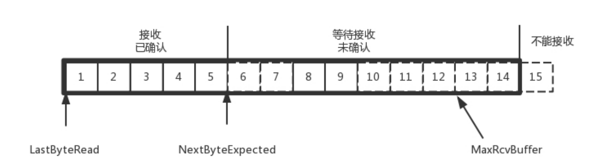

## UDP
### UDP 包头
发送的时候，我知道我发的是一个 UDP 的包，收到的那台机器咋知道的呢？所以在 IP 头里面有个 8 位
协议，这里会存放，数据里面到底是 TCP 还是 UDP，当然这里是 UDP。于是，如果我们知道 UDP 头
的格式，就能从数据里面，将它解析出来。解析出来以后呢？数据给谁处理呢？  
处理完传输层的事情，内核的事情基本就干完了，里面的数据应该交给应用程序自己去处理，可是一台
机器上跑着这么多的应用程序，应该给谁呢？  
无论应用程序写的使用 TCP 传数据，还是 UDP 传数据，都要监听一个端口。正是这个端口，用来区分
应用程序，要不说端口不能冲突呢。两个应用监听一个端口，到时候包给谁呀？所以，按理说，无论是
TCP 还是 UDP 包头里面应该有端口号，根据端口号，将数据交给相应的应用程序。  

### UDP 的三大特点
+ 沟通简单，不需要一肚子花花肠子（大量的数据结构、处理逻辑、包头字段）。前提是它相信网
络世界是美好的，秉承性善论，相信网络通路默认就是很容易送达的，不容易被丢弃的。
+ 轻信他人。它不会建立连接，虽然有端口号，但是监听在这个地方，谁都可以传给他数据，他也
可以传给任何人数据，甚至可以同时传给多个人数据。
+ 愣头青，做事不懂权变。不知道什么时候该坚持，什么时候该退让。它不会根据网络的情况进行
发包的拥塞控制，无论网络丢包丢成啥样了，它该怎么发还怎么发。
  
### UDP 的三大使用场景
+ 需要资源少，在网络情况比较好的内网，或者对于丢包不敏感的应用。
+ 不需要一对一沟通，建立连接，而是可以广播的应用。
+ 需要处理速度快，时延低，可以容忍少数丢包，但是要求即便网络拥塞，也毫不退缩，一往无前的时候。
  
## TCP
### TCP 包头
TCP的包头结构

1. 源端口号和目标端口号是不可少的，这一点和 UDP 是一样的。如果没有这两个端口号。数据就不 知道应该发给哪个应用。
2. 接下来是包的序号。为什么要给包编号呢？当然是为了解决乱序的问题。不编好号怎么确认哪个应该先来，哪个应该后到呢。
3. 还应该有的就是确认序号。发出去的包应该有确认，要不然我怎么知道对方有没有收到呢？如果没有收 到就应该重新发送，直到送达。
4. 接下来有一些状态位。例如 SYN 是发起一个连接，ACK 是回复，RST 是重新连接，FIN 是结束连接等。TCP 是面向连接的，因而双方要维护连接的状态，这些带状态位的包的发送，会引起双方的状态变 更。
5. 还有一个重要的就是窗口大小。TCP 要做流量控制，通信双方各声明一个窗口，标识自己当前能够的处理能力

### TCP 的三次握手
TCP 的连接建立，我们常常称为三次握手.我们也常称为“请求 -> 应答 -> 应答之应答”的三个回合。这个看起来简单，其实里面还是有很多的学问，很多的细节。  

三次握手除了双方建立连接外，主要还是为了沟通一件事情，就是TCP 包的序号的问题。

一开始，客户端和服务端都处于 CLOSED 状态。先是服务端主动监听某个端口，处于 LISTEN 状态。然
后客户端主动发起连接 SYN，之后处于 SYN-SENT 状态。服务端收到发起的连接，返回 SYN，并且
ACK 客户端的 SYN，之后处于 SYN-RCVD 状态。客户端收到服务端发送的 SYN 和 ACK 之后，发送
ACK 的 ACK，之后处于 ESTABLISHED 状态，因为它一发一收成功了。服务端收到 ACK 的 ACK 之
后，处于 ESTABLISHED 状态，因为它也一发一收了。

### TCP的几个状态
+ SYN synchronous 建立联机
+ FIN finish 表示关闭连接
+ ACK acknowledgement 表示响应
+ PSH push 表示有 DATA数据传输
+ RST reset 表示连接重置。

### TCP 状态端口协议说明
+ LISTENING 
~~~
提供某种服务，侦听远方TCP端口的连接请求，当提供的服务没有被连接时，处于LISTENING状态，端口是开放的，等待被连接
~~~

+ SYN_SENT (客户端状态)
~~~
客户端调用connect，发送一个SYN请求建立一个连接，在发送连接请求后等待匹配的连接请求，此时状态为SYN_SENT
~~~

+ SYN_RECEIVED (服务端状态)
~~~
在收到和发送一个连接请求后，等待对方对连接请求的确认，当服务器收到客户端发送的同步信号时，将标志位ACK和SYN置1发送给客户端，此时服务器端处于SYN_RCVD状态，如果连接成功了就变为ESTABLISHED，正常情况下SYN_RCVD状态非常短暂
~~~

+ ESTABLISHED
~~~
ESTABLISHED状态是表示两台机器正在传输数据。
~~~

+ FIN-WAIT-1
~~~
等待远程TCP连接中断请求，或先前的连接中断请求的确认，主动关闭端应用程序调用close，TCP发出FIN请求主动关闭连接，之后进入FIN_WAIT1状态。
~~~

+ FIN-WAIT-2
~~~
从远程TCP等待连接中断请求，主动关闭端接到ACK后，就进入了FIN-WAIT-2 .这是在关闭连接时，客户端和服务器两次握手之后的状态，是著名的半关闭的状态了，在这个状态下，应用程序还有接受数据的能力，但是已经无法发送数据，但是也有一种可能是，客户端一直处于FIN_WAIT_2状态，而服务器则一直处于WAIT_CLOSE状态，而直到应用层来决定关闭这个状态。
~~~

+ CLOSE-WAIT
~~~
等待从本地用户发来的连接中断请求 ，被动关闭端TCP接到FIN后，就发出ACK以回应FIN请求(它的接收也作为文件结束符传递给上层应用程序),并进入CLOSE_WAIT. 
~~~

+ CLOSING
~~~
等待远程TCP对连接中断的确认,处于此种状态比较少见
~~~

+ LAST-ACK
~~~
等待原来的发向远程TCP的连接中断请求的确认,被动关闭端一段时间后，接收到文件结束符的应用程序将调用CLOSE关闭连接,TCP也发送一个 FIN,等待对方的ACK.进入LAST-ACK
~~~

+ TIME-WAIT
~~~
在主动关闭端接收到FIN后，TCP就发送ACK包，并进入TIME-WAIT状态,等待足够的时间以确保远程TCP接收到连接中断请求的确认,很大程度上保证了双方都可以正常结束,但是也存在问题，须等待2MSL时间的过去才能进行下一次连接。
~~~

+ CLOSED
~~~
被动关闭端在接受到ACK包后，就进入了closed的状态，连接结束，没有任何连接状态
~~~

### TCP的四次挥手
A：B 啊，我不想玩了。  
B：哦，你不想玩了啊，我知道了。  
B：A 啊，好吧，我也不玩了，拜拜。  
A：好的，拜拜。  

### TCP 状态机

### TCP 的滑窗算法 (缓存控制)
tcp的一个靠谱的协议,每一个发送必须对应一个ack,但是是一个SYN发送,一个ACK回复这样速度太慢了.所有就有了TCP的滑窗算法

发送方窗口  

接收方窗口  

### TCP 拥塞控制 (网络拥塞)
tcp在同一时间发送多少个包的问题.  
慢启动 线速增长 到瓶颈之后会控制(BBR算法)

