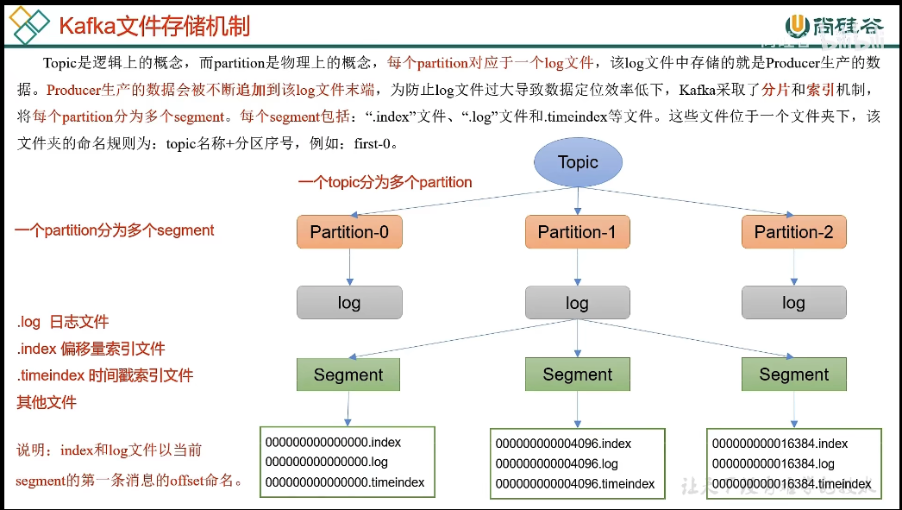

#kafka
整体分为三个部分分解,producer,broker,consumer

## producer
### 发送流程

### 分区的好处
1. 不同服务器broker的硬盘容量不同
2. 提高并行度(发送,消费)

### produce默认的分区策略
1. 有指定按照指定发送
2. 按照 key 的hash 取模
3. sticky partition模式,先随机一个,然后一段时间内一直使用这个

### producer提高吞吐量
1. 配置batch.size 合适的批次大小
2. liner.ms 等待时间 (默认是0ms)
3. compression 压缩
4. 缓冲区大小

### producer的数据可靠性
broker的ack应答模式有三种 0(落入缓冲区就应答) 1(leader partition写入磁盘就应答) all(所有partition写入磁盘才应答,一般情况下都用all)

引出一个问题: 如果配置是all,然后同步过程中一个follower挂了,是不是leader会一直等待
A: leader节点会维护ISR (in-sync replica set) 如果一个follower长时间没有和leader通信,会被踢到,默认30s

#### 确保发送的数据完全可靠条件
数据完全可靠条件 = AKC->ALL + follower partition >= 2 + ISR应答副本 >= 2

#### producer数据重复发送问题

leader节点在同步完所有follower之后正准备给producer返回ack,但是突然挂了,然后另一个follower成了leader,然后producer一直没收到这条消息的ACK,
于是又发送了一次msg,造成数据重复发送

解决方案:kafka内部支持幂等性,上面的情况再次发送kafka集群是不会存入broker的

原理: 内部有一个实现幂等性的标准 集群的pid+partition+seq_number 不重复,但是这也只能保证不重启之后幂等,因为重启kafka之后,pid会变

解决上述问题的方案: 用事务替代,事务可以自定义transaction_id替代pid实现幂等

### producer发送数据的有序性
目前kafka只能实现单个partition的有序性

## broker
### broker原理 (ZK版本), leader的选举
1. kafka开启之后去zk注册对应的broker_id
2. zk的controller中,那个kafka先注册那个说了算,controller决定了leader的选举
3. 选举规则 在iSR存货为前提,按照AR中的顺序,来轮询作为leader节点
4. controller将选举结果上传到ZK决定leader节点

### broker上下线 
ZK中 broker_ids管理节点
#### broker 服役新节点
问题: 之前有[0,1,2]三个broker,一个topic存储在[0,1,2]上,当新上线一个名为3的broker节点之后,怎么把之前的topic分配在3号broker上面的
解答: 可以在配置文件中添加新节点

#### broker 退役旧节点
和服役新节点类似

### broker的副本
副本统称AR , AR = ISR + OSR (和leader通信超时的副本)

leader的颗粒度,每一个partition都有一个leader

### 节点故障处理

LEO : 每个副本最后一个offset + 1

HW : high watermark , 所有副本的最小LEO

follower节点挂掉之后重新连接,需要追上HW之后,才能重新加入ISR

leader节点故障挂掉之后,选出了一个新的leader,当前旧的leader节点需要把高于当前的HW丢掉,从新从leader同步

### leader partition 自动平衡
问题: 如果某些broker宕机,导致leader partition集中在少数broker上,会导致这几台服务器压力过高,造成集群不平衡

解决:kafka有自动平衡机制,不平衡的leader比率默认10%,默认检查时间300s

不平衡算法: 

生成环境一般不开启自动平衡算法,频繁的选举对性能消耗大,或者增大比率

### kafka的文件存储

#### topic和partition概念
topic只是一个逻辑概念,partition才是一个物理概念

#### 文件存储和index索引

#### 文件保存
默认保存7天,7天之后默认删除,也可以配置成压缩

### kafka如何搞笑读写数据
1. 本身是分布式集群,采用了分区技术,数据分散,并行度高
2. 读数据采用稀疏索引,快速定位消费数据
3. 采用顺序写磁盘
4. 页缓存+零拷贝技术

## kafka consumer
### process
kafka采用pull的模式,好处是consumer可以自己控制速度,不足是如果kafka没有数据,consumer会陷入循环

### 消费组
每个组内负责消费不同分区数据,一个分区只能由一个消费组内消费

#### 消费组初始化流程

#### 消费组消费流程

### 消费者分区以及再平衡
问题: 一个CG(consumer group)里面有多个consumer,到底那个consumer消费那个partition呢

1. range方案

2. roundRobin : hash code 排序分配
3. sticky: 和range类型,不过是随机乱序分配

### offset的维护
以前的存储在zk中,现在存储在一个topic中

#### offset的自动提交
默认是开启自动提交,默认一个MSG到达kafka的partition之后,每隔5S自动提交offset

#### offset的手动提交
分为同步提交和异步提交

#### 指定offset消费
分为指定offset消费和指定时间消费,注意的是客户端需要等到分区初始化完成之后再设置需要指定的offset才生效

### consumer的重读消费问题

使用消费事务解决,在数据操作落库之后再提交事务

### consumer数据积压问题

## kafka的监控
可以使用kafka-eagle监控kafka状态,又名EFAK

## kafka新模式  KRAFT
去掉了依赖的ZK,原理就是用一个broker节点成为controller,让这个替代ZK所做的工作,这个成为的controller的broker也可以成为一个partition节点

